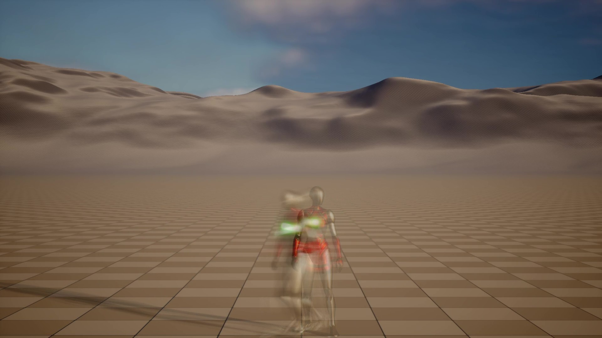
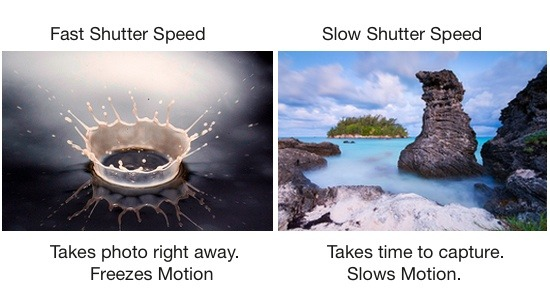

# Welcome to Long Exposure Docs!

## About

Long Exposure Component is a simple plugin that lets you quickly create long exposure effects in Unreal Engine. It works in both runtime and offline rendering (Movie Render Queue).

## Inspiration 

This plugin was inspired by this cool artwork I found on Pinterest. I wasn't able to create the artstyle 1:1 due to inherint engine limitations, which I'll cover in its own section. But I was able to recreate basic long exposure photography, that too in runtime.

## Limitations

Long exposure effects in real-time engines are fundamentally tied to the game's framerate. Unlike traditional photography, where a camera’s shutter can remain open to continuously accumulate light over time, a game engine is restricted by how many frames it can render per second. This creates a discrete sampling problem—each frame is a snapshot rather than a continuous exposure.

The more frames you can sample, the smoother and more convincing the long exposure effect becomes. In this context, high framerates improve visual fidelity. While ideas like integrating DLSS to simulate intermediate frames are interesting, they’re impractical for such a specific case.

That said, a stable 60 FPS is typically sufficient to convincingly simulate long exposure within most real-time applications. Just keep these constraints in mind when evaluating the effect’s capabilities.

